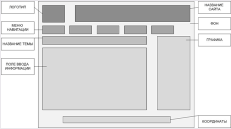

# Лабораторная 1

[< Lab0](./lab0.md) - [Lab2 >](./lab2.md)

Данная лабораторная подразумевает создание макета сайта без использования знаний CSS, только HTML. Создаем сайт резюме - портфолио. Главная задача данной лабораторной работы - ознакомиться с наиболее значимыми тегами и правилами их использования.

1. Установить любой текстовый редактор или же специализированное ПО (WebStorm и так далее) - на ваш выбор.
2. Определиться с темой проекта и нарисовать макет вашего сайта (схематично) - расположение картинок, текста, поля контактов... - картинку также положить в гит репозиторий (Можно фотографию рисунка на листочке)

Пример:

В качестве темы подойдут: портфолио с галереей, интернет-магазин, гостевая книга, блог и т.п.

3. Задать кодировку страницы  UTF-8
4. Описать ключевые слова в метаинформации страницы, а также в описании страницы
5. Для упрощения проектирования подключить файл стилей `outlines.css` (опционально)
6. Приступить к написанию сайта: 
    - Добавить Doctype
    - Добавить теги `<html>`, `<head>` и `<body>`,
    - Установить язык для сайта-русский
    - Добавить заголовок страницы
    - Убедиться что в readme.md указана ваше ФИО и номер группы, добавить выбранную тему.
    - Выделить логические элементы вашего сайта с помощью  тегов:
        - `main`
        - `header`
        - `footer`
    - Использовать теги `section`, `nav`, `article`, `aside`, `h1`-`h6`, `p` - согласно их предназначению. (смотреть лекцию)
    - Использовать теги перечисления (`ul`, `ol`) (например, для описание ваших успехов или неуспехов).
    - Вставить блок с псевдографикой из символов `ASCII`
    - Вставить snippet кода, оформив его соответствующими тегами.
    - Добавить цитату и формулу вашего успеха (желательно использовать тэги `sub` и `sup`)
    - Для выделения наиболее важных моментов использовать `strong` и `b`, `em` и `i`, `del` и `ins`
 

> Если имеется понимание, для чего нужен `div` и `span` - использовать, если нет, то начать изучать вопрос)
> Цель работы - создание макета и наполнение его информацией. Если один-два подпункта из 6 пункта кажутся избыточными, и вы сможете доказать, почему на вашем сайте они не нужны (возможно предложив другие пункты) - на финальный балл не повлияет.
> Для большей простоты выделения элементов и понимания их расположения предлагается использовать [https://github.com/ArtMan-8/outline-prototype](https://github.com/ArtMan-8/outline-prototype) или аналоги.
