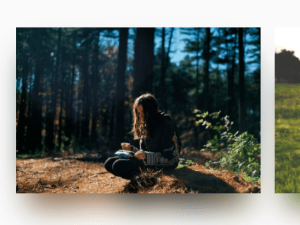

# Лабораторная 2

[< Lab1](./lab1.md) - [Lab3 >](./lab3.md)

Цель лабораторной - научиться создавать и привязывать стили для элементов html. Про размещение элементов пока можно не думать, необходимо достичь эффекта, при котором отдельно взятый элемент смотрится законченным, красивым и приятным глазу. 

При этом вместе эти элементы не пестрят разными красками. Советую использовать сервисы по сочетаемости цветом - перед началом выполнения лабораторной определиться со стилистикой вашего сайта.

Например: [https://color.adobe.com/ru/](https://color.adobe.com/ru/)

На той же странице, написанной в рамках первой лабораторной работы:
1. Создать и подключить собственный файл стилей
2. Добавить стили всем элементам на странице (границы - отступы и шрифты). 
3. Должны быть использованы различные по типу селекторы. (Желательно по какой-либо конкретной методологии, например БЭМ)
4. Добавить картинки.
5. Определить цвета заливки и теней для элементов

Пример shadow drop:

6. Применить стили для текста, задать свойства:
    - Размера шрифта
    - Высоты строки
    - Семейство используемых шрифтов
    - Насыщенность шрифта
    - Выравнивание текста (горизонтальное, вертикальное)
    - Фон и цвет текста
    - Отступы
    - Пробелы
    - Стилизация  переформатированного текста
    - Подчеркивание, зачеркивание и  другие
    - Регистр символов
