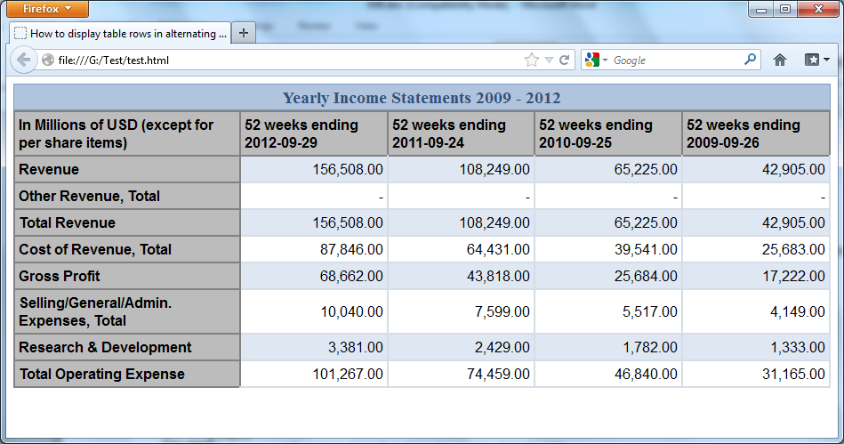

# Лабораторная 3

[< Lab2](./lab2.md) - [Lab4 >](./lab4.md)

Произвести выравнивание всех ранее описанных элементов вашего сайта используя удобный для вас способ - флексы или флоты либо применить 12-ти столбчатую вёрстку. Обязательное наличие горизонтальных и вертикальных рядов элементов. Если у вас до этого не было - всегда можно добавить – например, галерею с картинками.

Также необходимо проработать то, как ваш макет будет выглядеть на различных мониторах (на маленьком ноутбуке, полноценном Full HD, 2K монитор). Выбрать элементы, которые не будут отображаться на маленьких мониторах, например, рекламный баннер во всю длину footer’a. 
1. Использовать css-правила @media screen для скрытия элементов не умещающихся в клиентскую область
2. Закрепить элемент с помощью абсолютного позиционирования - например строку меню либо шапку или подвал сайта. 
3. Добавить на страницу таблицу с заголовками и стилями для чётных и нечётных строк. В качестве типа отображения таблицы рекомендуется воспользоваться grid’ом, для достижения лучшей адаптивности. (т.е. необходимо добиться того, чтобы колонки таблицы изменяли свой размер в зависимости от размера окна)
пример:

