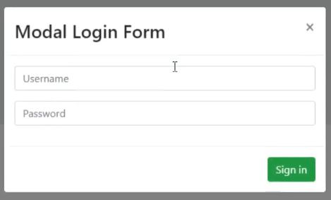
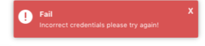

# Лабораторная 7

[< Lab6](./lab6.md)

Целью лабораторной работы является изучение продвинутых практик взаимодействия с DOM и CSS с использованием подключаемых JS библиотек.

Студентам предлагается продемонстрировать умения работы со сторонними API популярных библиотек.

1. Выберите одну – две UI библиотеки которые можно интегрировать в ваш проект из предложенного списка: [https://github.com/sorrycc/awesome-javascript](https://github.com/sorrycc/awesome-javascript)

Например: Модальное окно + `Toster`

 + 

Либо: [Слайдер](https://swiperjs.com/demos/130-centered/core.html) для вашей галереи

2. Опишите use-case сценарий с использованием выбранных библиотек и реализуйте его.
3. Добавьте комментарии в JS-коде перед вызовами сторонних библиотек с указанием того какой аргумент функции для чего используется и как именно вы конфигурируете ту или иную часть библиотеки.
4. Добавьте стилизацию подключенных компонентов, чтобы они не выбивались из уже используемой цветовой палитры вашего проекта.

> Лабораторная работа скорее творческая и поможет добрать недостающие баллы если подключенные библиотеки будет использованы качественно в полном объеме предлагаемых возможностей. (т.е. подключение всего `Bootstrap` фреймворка ради одного элемента внутри таблички не выглядит оправданным)
