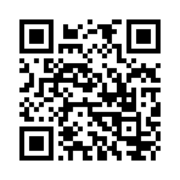

# Web, практика 1

## [Гугл-форма](https://forms.gle/5K4j4BaE5bbvHiGD6) со сбором контактной информации

## Информация и полезные ссылки

1. Для основных лаб (1-7) придумайте проект, который вам интересен / под который можно будет подвязать бэк. 10kk портфолио с галереей смотреть не хочется + вы не сделаете для него адекватный бэк
2. Дисциплина нынче не зачётная, а диф. зачётная – учитывай это
3. [ИИ-генератор макетов](https://app.visily.ai/)
    - [Пример](https://app.visily.ai/projects/90f7ea52-bf55-477d-8eb2-38f1b2c6ca8c/boards/1215563) на тему "Интернет-магазин bubble-tea"
4. Формат проведения пар:
    - Пара == сдача лабы
    - Пара == возможность задать мне вопрос
    - Пара == возможность доделать лабу, если я дал правки
    - В любом другом случае можно не ходить – посещения не отмечаю
5. Формат выполнения и сдачи лабы:
    - Открой [условия лабы](https://docs.google.com/document/d/1ybmhKPyUyZvGaJI-3MrM9AleAW9Kzng8/edit?usp=sharing&ouid=111575169959601104712&rtpof=true&sd=true)
    - Сделай лабу
    - В своём репозитории создай новую ветку
    - Запуш в неё код
    - Открой Pull Request (PR) с адекватным названием (если это первая лаба – назови его условно `Lab1`, а не `PisyaPopaKakashechki`): `LabN` -> `master`
    - Приходи на пару – я посмотрю PR, если что-то не так – дам правки, если всё ок – поставлю аппрув, дам баллы
    - Дедлайн считать буду по открытому Pull Request'у при условии, что в нём было что-то адекватное, а не в последний день добавлена 1 строка в README

## Q&A

### 1. Можно обращаться на "ты"?

> Да

### 2. Я не успел открыть PR в дедлайн, что же мне теперь делать?

> Открывай его и приходи сдавать, когда будешь готов, но за лабу будет максимум 80% баллов

### 3. Я хочу сдать все лабы 31 декабря

> Увидимся на допсе

### 4. Можно сдать несколько лаб за 1 раз?

> Да, но в рамках приличия, чтобы оставшаяся группа не ждала своей сдачи до следующей пары + если ты не студент из [вопроса 3](#3-я-хочу-сдать-все-лабы-31-декабря)

### 5. Я открыл PR заранее, но не пришёл на ближайшую пару по причине ..., мне надо об этом предупредить? За это будет штраф?

> Нет, предупреждать не надо. Нет, штрафа не будет, если ты не студент из [вопроса 3](#3-я-хочу-сдать-все-лабы-31-декабря)

### 6. Во время пары мне очень захотелось покурить / в туалет / ещё куда-то, мне надо спросить разрешение?

> Нет, просто встань и выйди

### 7. Я работаю фронтом N времени, можно я покажу какой-нибудь рабочий проект и всё?

> Если этот проект написан не на `React` / `Angular` / `Vue` / любом другом фреймворке, а на чистых `html` + `css` + `js`, а также если в нём есть всё, что требуют лабы, то да, иначе – нет
